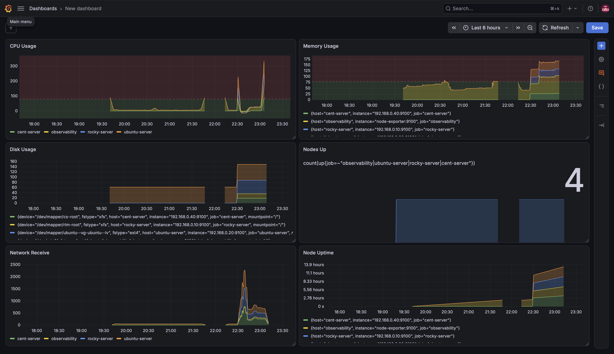

# Linux Observability Lab

A multi-node Linux observability lab built to monitor Linux infrastructure metrics, centralize system logs, visualize system health, and deliver infrastructure alerts.

The lab uses an Ubuntu Desktop system as the central observability server and monitors Ubuntu Server, Rocky Linux, and CentOS nodes.

The project has evolved from a basic Prometheus and Grafana monitoring setup into a multi-node observability environment with centralized logging, alerting, Grafana Alloy, and Ansible configuration management.

## Architecture

```text
                         Ubuntu Desktop
                      Observability Server
                   ┌─────────────────────────┐
                   │                         │
                   │      Prometheus         │
                   │        :9090            │
                   │                         │
                   │        Grafana          │
                   │        :3000            │
                   │                         │
                   │         Loki            │
                   │        :3100            │
                   │                         │
                   │      Alertmanager       │
                   │        :9093            │
                   │                         │
                   │    Alloy (Docker)       │
                   │                         │
                   └────────────┬────────────┘
                                │
               ┌────────────────┼────────────────┐
               │                │                │
               ▼                ▼                ▼
        Rocky Server      Ubuntu Server      CentOS Server
        192.168.0.10      192.168.0.20       192.168.0.40
               │                │                │
               │                │                │
         Node Exporter    Node Exporter    Node Exporter
            :9100            :9100            :9100
               │                │                │
             Alloy            Alloy            Alloy
            systemd           systemd           systemd
               │                │                │
               └────────────────┼────────────────┘
                                │
                         Systemd Journal
                                │
                                ▼
                               Loki
                                │
                                ▼
                             Grafana


                    Alerting Flow

        Node Exporter
              │
              ▼
          Prometheus
              │
         Alert Rules
              │
              ▼
         Alertmanager
              │
              ▼
           Discord
```

## Project Evolution

The project started as a small Linux monitoring environment consisting of:

- Ubuntu Desktop observability server
- Ubuntu Server
- Rocky Linux
- Prometheus
- Node Exporter
- Grafana
- Loki
- Promtail
- Alertmanager
- Discord notifications

The lab was later expanded with a CentOS node, creating a three-node Linux monitoring environment.

Promtail was subsequently replaced by Grafana Alloy for centralized systemd journal collection.

Ansible was then introduced to automate configuration and service management across the monitoring nodes.

## Current Infrastructure

| Host | Role | Metrics | Logs |
|---|---|---|---|
| Ubuntu Desktop | Observability server | Node Exporter | Alloy |
| Ubuntu Server | Monitoring node | Node Exporter | Alloy |
| Rocky Linux | Monitoring node | Node Exporter | Alloy |
| CentOS | Monitoring node | Node Exporter | Alloy |

The central observability stack runs on the Ubuntu Desktop system.

The Ubuntu Server, Rocky Linux, and CentOS systems act as monitored Linux nodes.

## Technology Stack

| Component | Purpose |
|---|---|
| Prometheus | Metrics collection and alert rule evaluation |
| Node Exporter | Linux host metrics |
| Grafana | Metrics and log visualization |
| Loki | Centralized log storage |
| Grafana Alloy | System journal collection and forwarding |
| Alertmanager | Alert routing and notification management |
| Discord | External alert notifications |
| Docker Compose | Runs the central observability stack |
| Ansible | Configuration management and automation |
| systemd | Service management on monitoring nodes |

## Metrics Monitoring

Prometheus collects Linux infrastructure metrics from Node Exporter.

The monitoring environment provides visibility into:

- CPU utilization
- Memory utilization
- Filesystem usage
- Disk utilization
- Network traffic
- Host availability
- Node uptime
- Node Exporter health

Prometheus also evaluates infrastructure alert rules and monitors the availability of configured scrape targets.

The current monitored Node Exporter targets are:

```text
node-exporter:9100
192.168.0.20:9100
192.168.0.10:9100
192.168.0.40:9100
```

These represent the observability server, Ubuntu Server, Rocky Linux, and CentOS respectively.

## Grafana Dashboard

The Grafana infrastructure dashboard provides a simple overview of the monitored Linux environment.

The dashboard includes:

- Nodes Up
- Nodes Down
- CPU Usage
- Memory Usage
- Disk Usage
- Network Receive
- Network Transmit
- Node Uptime

The dashboard is intentionally kept focused on core infrastructure metrics rather than application-specific metrics.

## Centralized Logging

The project originally used Promtail for log collection.

The logging pipeline has since been migrated to Grafana Alloy.

Alloy runs natively on the monitored Linux systems as a systemd-managed service.

Each monitoring node reads persistent systemd journal data from:

```text
/var/log/journal
```

The logs are then forwarded to Loki on the central observability server.

The current logging pipeline is:

```text
Linux systemd journal
        │
        ▼
   Grafana Alloy
        │
        ▼
       Loki
        │
        ▼
     Grafana
```

Each host adds its hostname as a Loki label.

Example LogQL queries:

```logql
{job="journal"}
```

```logql
{host="ubuntu-server"}
```

```logql
{host="rocky-server"}
```

```logql
{host="cent-server"}
```

Errors and failures can also be filtered:

```logql
{job="journal"} |~ "(?i)error|failed|failure"
```

## Grafana Alloy

Grafana Alloy is installed natively on the monitored Linux systems.

The service is managed with systemd:

```bash
systemctl status alloy
```

Alloy is responsible for:

- Reading persistent journald logs
- Adding host-specific labels
- Forwarding logs to Loki
- Running continuously as a system service
- Starting automatically with the system

The monitored nodes therefore do not require Docker to run their logging agents.

The observability server has its own Alloy deployment as part of the central observability environment.

## Alerting

Prometheus evaluates infrastructure alert rules and sends firing alerts to Alertmanager.

The lab includes alerts for infrastructure conditions such as:

- Instance availability
- High CPU utilization
- High memory utilization
- High disk utilization

The alerting flow is:

```text
Node Exporter
     │
     ▼
 Prometheus
     │
     ▼
 Alert Rule
     │
     ▼
Alertmanager
     │
     ▼
 Discord
```

Alertmanager handles alert routing and notification delivery.

The alerting system has been tested by generating resource pressure on monitored systems and verifying that Prometheus detects the condition, Alertmanager processes the alert, and Discord receives the notification.

## Ansible Configuration Management

Ansible was introduced to automate the configuration and management of the three monitoring nodes.

The Ansible project is located in:

```text
ansible/
├── ansible.cfg
├── inventory/
│   └── hosts
└── playbooks/
    ├── files/
    │   └── config.alloy.j2
    ├── alloy.yml
    └── node_exporter.yml
```

The inventory defines:

```text
rocky-server
ubuntu-server
cent-server
```

### Node Exporter Automation

Ansible manages the Node Exporter systemd service across the monitoring nodes.

The playbook ensures that Node Exporter is:

- Enabled
- Running

The Node Exporter playbook does not maintain a custom configuration file because the package defaults are sufficient for this lab.

Run it with:

```bash
ansible-playbook playbooks/node_exporter.yml
```

### Alloy Automation

Ansible manages Grafana Alloy across the monitoring nodes.

The Alloy playbook ensures that:

- Grafana Alloy is installed
- The Alloy configuration exists
- The configuration is generated from an Ansible template
- Each host receives its own hostname label
- Alloy is enabled
- Alloy is running
- Alloy is restarted when its configuration changes

The Alloy configuration uses the Ansible inventory hostname:

```alloy
labels = {
  job  = "journal",
  host = "{{ inventory_hostname }}",
}
```

This allows each server's logs to be identified centrally in Loki.

Run the Alloy playbook with:

```bash
ansible-playbook playbooks/alloy.yml
```

Check the proposed changes before applying them:

```bash
ansible-playbook playbooks/alloy.yml --check --diff
```

Test connectivity to the monitoring nodes:

```bash
ansible monitoring_nodes -m ping
```

Check the Alloy service state:

```bash
ansible monitoring_nodes -a "systemctl is-active alloy"
```

Check whether Alloy is enabled:

```bash
ansible monitoring_nodes -a "systemctl is-enabled alloy"
```

The Alloy playbook has been tested for idempotency, so subsequent runs do not unnecessarily modify the configuration or restart the service when nothing has changed.

## Project Structure

```text
linux-observability-lab/
├── alertmanager/
│   └── alertmanager.yml.template
├── alloy/
├── ansible/
│   ├── ansible.cfg
│   ├── inventory/
│   │   └── hosts
│   └── playbooks/
│       ├── files/
│       │   └── config.alloy.j2
│       ├── alloy.yml
│       └── node_exporter.yml
├── docs/
│   └── screenshots/
├── loki/
│   └── loki-config.yml
├── prometheus/
│   ├── prometheus.yml
│   └── alerts.yml
├── docker-compose.yml
└── README.md
```

## Running the Central Observability Stack

The central observability components run on the Ubuntu Desktop observability server.

Clone the repository:

```bash
git clone https://github.com/OB-Adams/linux-observability-lab.git
cd linux-observability-lab
```

Start the central stack:

```bash
docker compose up -d
```

Check the containers:

```bash
docker compose ps
```

The central stack uses Docker Compose.

The monitored Linux systems run Node Exporter and Grafana Alloy natively through systemd.

## Running the Ansible Automation

From the repository root:

```bash
cd ansible
```

Test connectivity:

```bash
ansible monitoring_nodes -m ping
```

Manage Node Exporter:

```bash
ansible-playbook playbooks/node_exporter.yml
```

Manage Grafana Alloy:

```bash
ansible-playbook playbooks/alloy.yml
```

Preview Alloy changes:

```bash
ansible-playbook playbooks/alloy.yml --check --diff
```

Verify Alloy:

```bash
ansible monitoring_nodes -a "systemctl is-active alloy"
```

```bash
ansible monitoring_nodes -a "systemctl is-enabled alloy"
```

## Access

| Service | Port |
|---|---:|
| Grafana | 3000 |
| Prometheus | 9090 |
| Alertmanager | 9093 |
| Loki | 3100 |
| Node Exporter | 9100 |
| Alloy HTTP API | 12345 |

## Security

The Discord webhook is kept outside version control.

The Alertmanager configuration uses an environment variable rather than storing the webhook directly in the repository.

Generated configuration containing the webhook is excluded from Git.

This prevents notification credentials from being committed to the repository.

## What I Learned

This project was built as a practical Linux and infrastructure engineering lab.

Key areas explored include:

- Linux system administration
- Ubuntu Server
- Rocky Linux
- CentOS
- systemd
- systemd journal
- journald persistence
- Prometheus
- Node Exporter
- Grafana
- Loki
- Grafana Alloy
- LogQL
- Prometheus alert rules
- Alertmanager
- Discord notifications
- Docker Compose
- Ansible inventory
- Ansible templates
- Ansible systemd management
- Idempotent configuration management
- Multi-node monitoring
- Centralized logging
- Infrastructure alerting

## Screenshots

### Grafana Infrastructure Dashboard

The Grafana dashboard provides an overview of the monitored Linux infrastructure, including node availability, CPU usage, memory usage, filesystem usage, network traffic, and node uptime.



### Prometheus Alert

Prometheus detects infrastructure conditions and exposes active alerts through the Prometheus interface.


### Discord Alert

Alertmanager forwards configured infrastructure alerts to Discord.


## Future Work

The observability lab will continue to focus on Linux infrastructure monitoring, automation, and operational visibility.

Planned areas include:

- Terraform-based infrastructure provisioning
- Expanded Ansible configuration management
- Blackbox Exporter
- Multi-node service monitoring
- Additional infrastructure monitoring and automation

OpenTelemetry is intentionally deferred for now so the project can remain focused on Linux infrastructure, monitoring, automation, and SRE fundamentals.

## Author

OB Adams

Linux, Cloud, DevOps, and Infrastructure Automation

## TL;DR

This project is a multi-node Linux observability lab using Prometheus, Node Exporter, Grafana, Loki, Grafana Alloy, Alertmanager, Docker Compose, and Ansible.

It monitors Ubuntu Server, Rocky Linux, CentOS, and the central observability server, collects system metrics, centralizes journald logs, visualizes infrastructure health in Grafana, and sends infrastructure alerts through Alertmanager to Discord.

Ansible automates Node Exporter service management and Grafana Alloy installation, configuration, and systemd management across the monitoring nodes.
