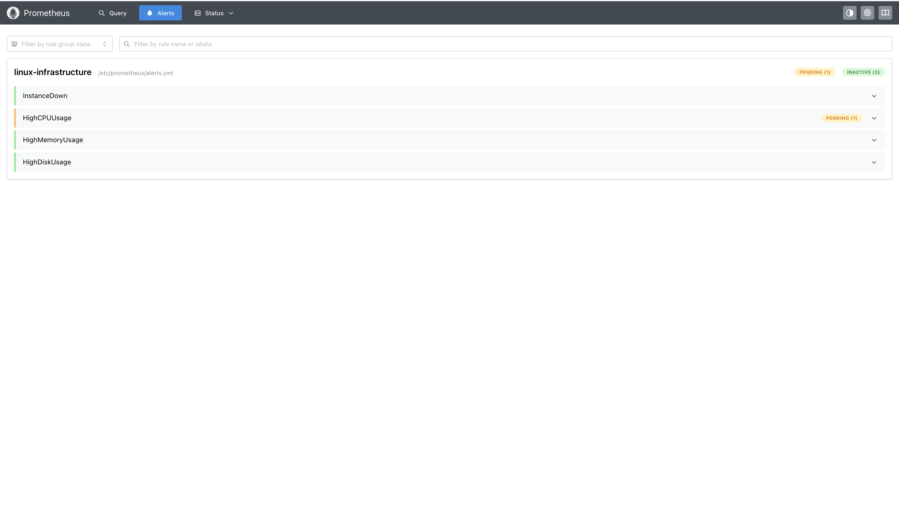
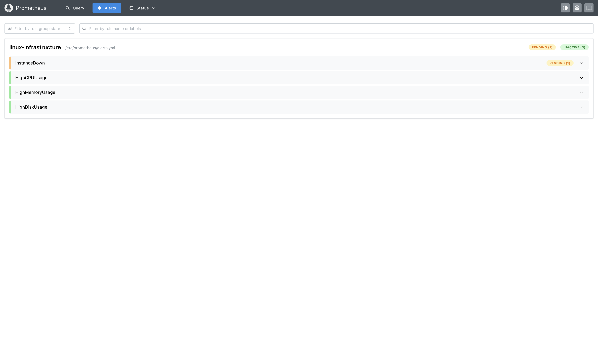
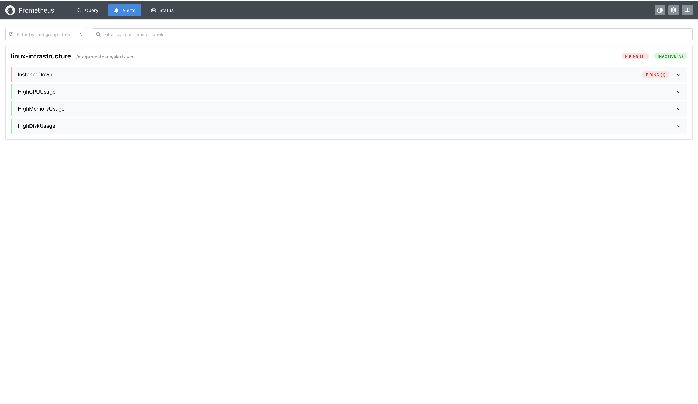
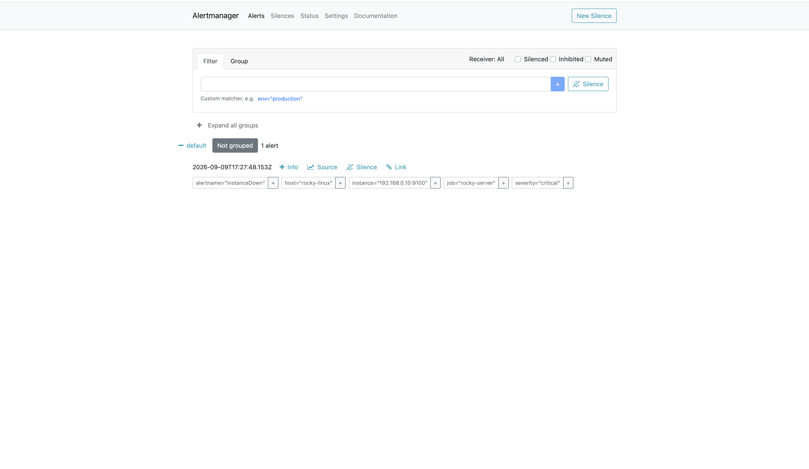
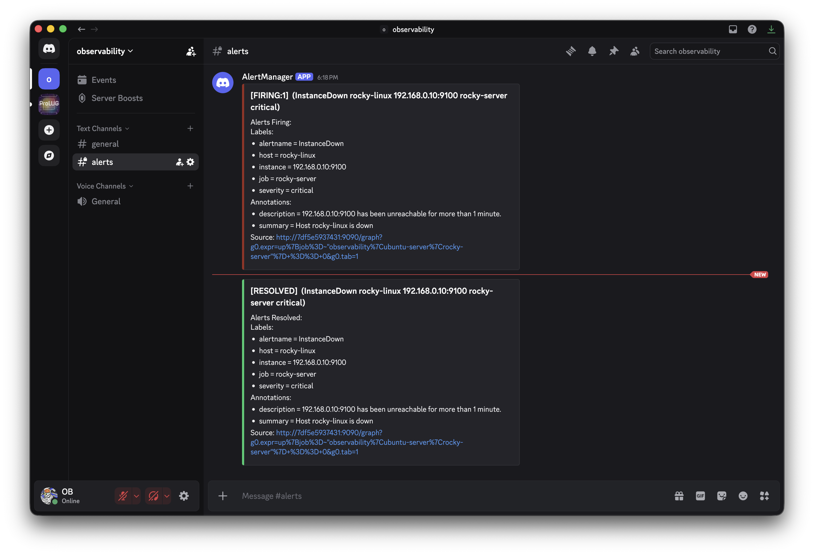

# Linux Observability Lab

A multi-host Linux observability lab built with Prometheus, Grafana, Loki, Promtail, and Alertmanager.

The project monitors Linux infrastructure metrics, centralizes system logs, visualizes infrastructure health, and sends alerts to Discord when monitored systems experience issues.

## Architecture

```text
                         ┌──────────────┐
                         │   Grafana    │
                         │    :3000     │
                         └──────┬───────┘
                                │
                 ┌──────────────┴──────────────┐
                 │                             │
                 ▼                             ▼
          ┌─────────────┐                ┌─────────────┐
          │ Prometheus  │                │    Loki     │
          │    :9090    │                │    :3100    │
          └──────┬──────┘                └──────┬──────┘
                 │                              │
          Metrics│                              │Logs
                 │                              │
       ┌─────────┼─────────┐          ┌─────────┼─────────┐
       ▼         ▼         ▼          ▼         ▼         ▼
    Ubuntu    Ubuntu      Rocky    Ubuntu    Ubuntu     Rocky
    Desktop   Server      Linux    Server    Desktop    Linux
   Node Exp.  Node Exp.  Node Exp. Promtail  Promtail   Promtail
       │
       ▼
 ┌──────────────┐
 │ Alertmanager │
 │    :9093     │
 └──────┬───────┘
        │
        ▼
     Discord
```

## Stack

| Component | Purpose |
|---|---|
| Prometheus | Metrics collection and alert rule evaluation |
| Node Exporter | Linux host metrics |
| Grafana | Metrics and log visualization |
| Loki | Centralized log storage |
| Promtail | Log collection and forwarding to Loki |
| Alertmanager | Alert routing and notification management |
| Discord | External alert notifications |
| Docker Compose | Container orchestration |

## Monitored Hosts

- Ubuntu Desktop - Observability server
- Ubuntu Server - Monitored Linux server
- Rocky Linux - Monitored Linux server

## Project Structure

```text
observability/
├── docker-compose.yml
├── .gitignore
├── prometheus/
│   ├── prometheus.yml
│   └── alerts.yml
├── alertmanager/
│   └── alertmanager.yml.template
├── loki/
│   └── loki-config.yml
├── promtail/
│   └── promtail-config.yml
└── docs/
    └── screenshots/
        ├── centralised dashboard.png
        ├── observability-server-logs.png
        ├── prometheus-hosts.png
        ├── ubuntu-server-logs.png
        ├── alertmanger-notification.png
        ├── discord-alertmanager-notification.png
        ├── prom-cpu-pending.png
        ├── prom-instance-firing.png
        └── prom-instance-pending.png
```

## Metrics Monitoring

Prometheus collects infrastructure metrics from Node Exporter running on the monitored Linux systems.

The infrastructure dashboard provides visibility into:

- CPU utilization
- Memory utilization
- Disk utilization
- System load
- Network traffic
- Host availability

Prometheus also monitors the health of the configured targets and evaluates infrastructure alert rules.

## Centralized Logging

Loki provides centralized log storage while Promtail collects logs from the monitored Linux systems.

Logs can be queried by host and other labels through Grafana.

Example LogQL queries:

```text
{job="varlogs"}
```

```text
{host="ubuntu-server"}
```

```text
{host="rocky-linux"}
```

```text
{host="observability"}
```

Example filtered query:

```text
{job="varlogs"} |= "error"
```

## Alerting

Prometheus evaluates infrastructure alert rules and sends firing alerts to Alertmanager.

Configured alerts include:

- Instance down
- High CPU usage
- High memory usage
- High disk usage

Alert rules use thresholds and evaluation periods to prevent short-lived spikes from immediately generating alerts.

### Alert Flow

```text
Node Exporter
     │
     ▼
Prometheus
     │
     ▼
Alert Rule
     │
     ▼
Alertmanager
     │
     ▼
Discord
```

Alertmanager handles alert routing and notification delivery.

## Alertmanager Configuration

Alertmanager uses a configuration template containing the Discord webhook environment variable.

The Discord webhook is stored in `.env` and excluded from version control.

The configuration is generated with `envsubst`:

```bash
envsubst < alertmanager/alertmanager.yml.template > alertmanager/alertmanager.yml
```

The generated `alertmanager.yml` is then mounted into the Alertmanager container.

This keeps the Discord webhook out of the configuration template and Git repository.

## Screenshots

### Grafana Infrastructure Dashboard

Overview of infrastructure metrics collected from the monitored Linux hosts.


### Observability Server Logs

Logs collected from the observability server and visualized through Grafana and Loki.


### Prometheus Monitored Hosts

Prometheus showing the monitored Linux hosts and their scrape status.


### Ubuntu Server Logs

Centralized Ubuntu Server logs collected through Promtail and Loki.


### Prometheus CPU Alert Pending

Prometheus detecting sustained high CPU utilization and placing the alert into the pending state.



### Prometheus Instance Alert Pending

Prometheus detecting an unavailable monitored instance.



### Prometheus Instance Alert Firing

The instance-down alert transitioning from pending to firing after the configured evaluation period.



### Alertmanager Notification

Alertmanager receiving and displaying the firing infrastructure alert.



### Discord Alertmanager Notification

Alertmanager delivering the infrastructure alert to Discord.



## Running the Stack

Clone the repository and start the observability stack with Docker Compose:

```bash
git clone <repository-url>
cd observability
docker compose up -d
```

Check the running containers:

```bash
docker compose ps
```

## Access

| Service | Port |
|---|---:|
| Grafana | 3000 |
| Prometheus | 9090 |
| Alertmanager | 9093 |
| Loki | 3100 |
| Node Exporter | 9100 |

## Security

The Discord webhook is stored in `.env` and excluded from version control.

The Alertmanager configuration template contains only the environment variable placeholder.

The generated `alertmanager.yml` containing the substituted webhook is also excluded from version control.

Secrets are therefore not stored in the Git repository.

## Author

**OB Adams**

Linux, Cloud, DevOps, and Infrastructure Automation
