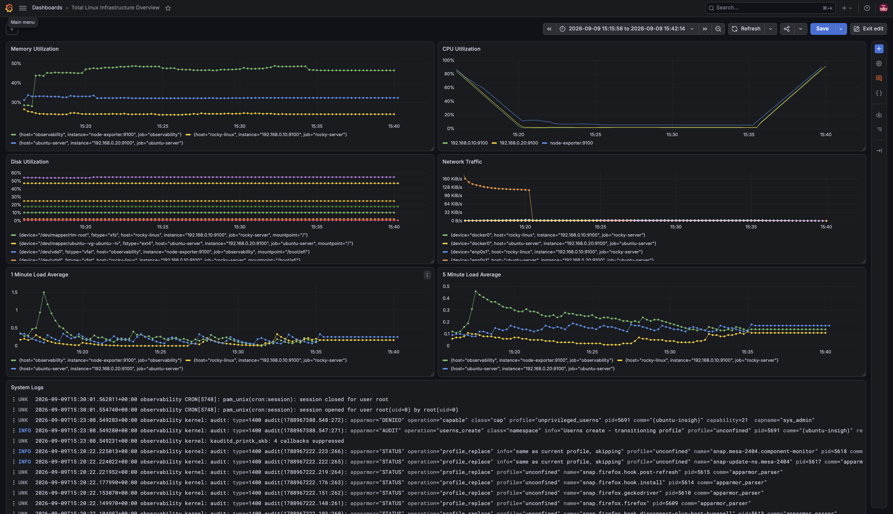
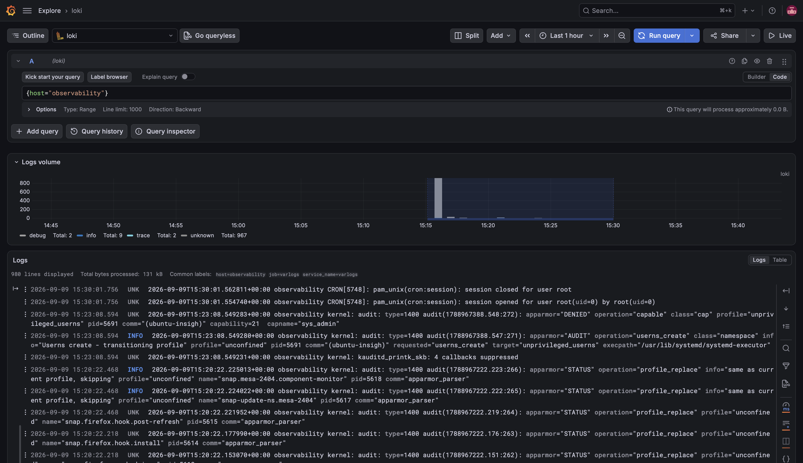
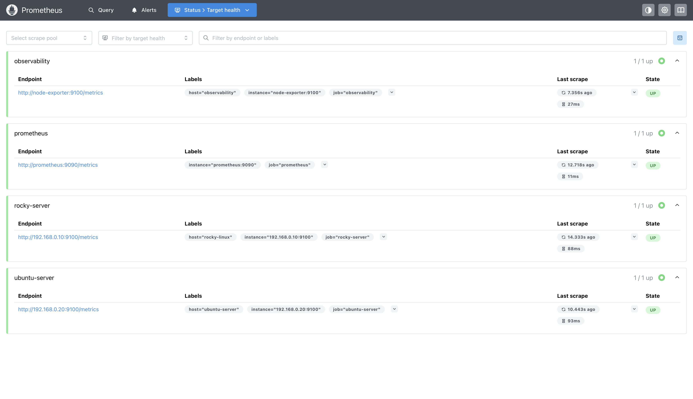
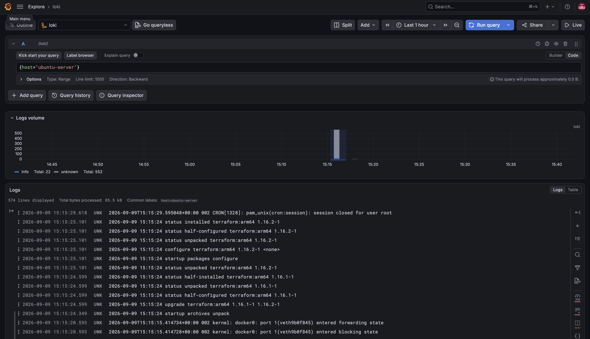

# Linux Observability Lab

A hands-on Linux observability stack for monitoring infrastructure metrics and collecting centralized system logs across multiple Linux hosts.

## Architecture

```text
                         ┌──────────────┐
                         │   Grafana    │
                         │    :3000     │
                         └──────┬───────┘
                                │
                 ┌──────────────┴──────────────┐
                 │                             │
                 ▼                             ▼
          ┌─────────────┐                ┌─────────────┐
          │ Prometheus  │                │    Loki     │
          │    :9090    │                │    :3100    │
          └──────┬──────┘                └──────┬──────┘
                 │                              │
          Metrics│                              │Logs
                 │                              │
       ┌─────────┼─────────┐          ┌─────────┼─────────┐
       ▼         ▼         ▼          ▼         ▼         ▼
    Ubuntu    Ubuntu      Rocky    Ubuntu    Ubuntu     Rocky
    Desktop   Server      Linux    Server    Desktop    Linux
   Node Exp.  Node Exp.  Node Exp. Promtail  Promtail   Promtail
```

## Stack

| Component | Purpose |
|---|---|
| **Prometheus** | Metrics collection and alerting |
| **Node Exporter** | Linux host metrics |
| **Grafana** | Metrics and log visualization |
| **Loki** | Centralized log aggregation |
| **Promtail** | Log collection |
| **Docker Compose** | Container orchestration |

## Monitored Hosts

- Ubuntu Desktop — Observability Server
- Ubuntu Server
- Rocky Linux

The observability server hosts the central Prometheus, Grafana, Loki, and Promtail services.

## Project Structure

```text
observability/
├── docker-compose.yml
├── prometheus/
│   ├── prometheus.yml
│   └── alerts.yml
├── loki/
│   └── loki-config.yml
├── promtail/
│   └── promtail-config.yml
└── docs/
    └── screenshots/
        ├── centralised-dashboard.png
        ├── observability-server-logs.png
        ├── prometheus-hosts.png
        └── ubuntu-server-logs.png
```

## Metrics

Prometheus collects infrastructure metrics including:

- CPU utilization
- Memory utilization
- Disk usage
- Network traffic
- System load
- Host availability

## Logging

Promtail collects system logs from the Linux hosts and forwards them to the central Loki server.

Logs can be queried and visualized through Grafana using LogQL.

## Screenshots

### Grafana Infrastructure Dashboard

Overview of infrastructure metrics collected from the monitored Linux hosts.



### Observability Server Logs

Logs collected from the observability server and visualized through Grafana and Loki.



### Prometheus Monitored Hosts

Prometheus showing the monitored Linux hosts and their scrape status.



### Ubuntu Server Logs

Centralized Ubuntu Server logs collected through Promtail and Loki.



## Running the Stack

```bash
cd ~/observability
docker compose up -d
```

Check the services:

```bash
docker compose ps
```

Stop the stack:

```bash
docker compose down
```

## Access

| Service | URL |
|---|---|
| Grafana | `http://<observability-ip>:3000` |
| Prometheus | `http://<observability-ip>:9090` |
| Loki | `http://<observability-ip>:3100` |

## Alerting

Prometheus alerting is being implemented for:

- Host availability
- High CPU usage
- High memory usage
- High disk usage

Alertmanager will be added for notification delivery.

## Author

**OB Adams**

Linux • Cloud • DevOps • Infrastructure
