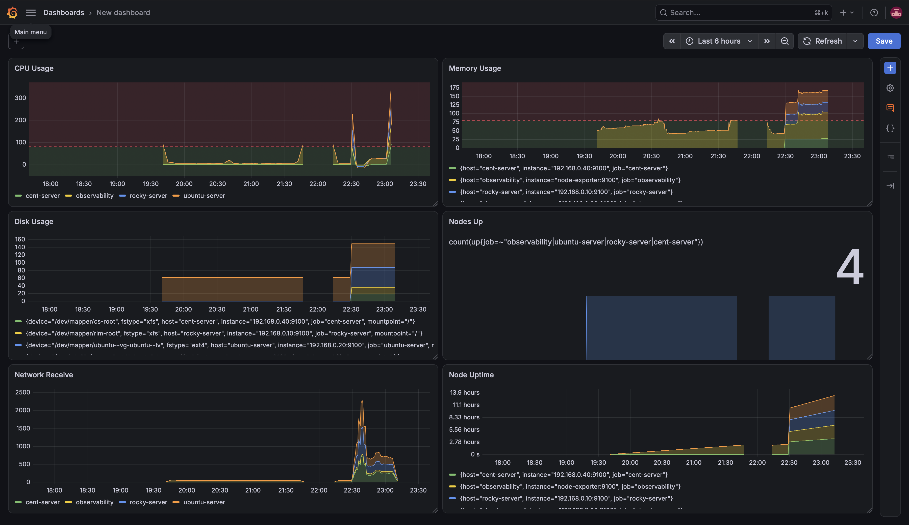
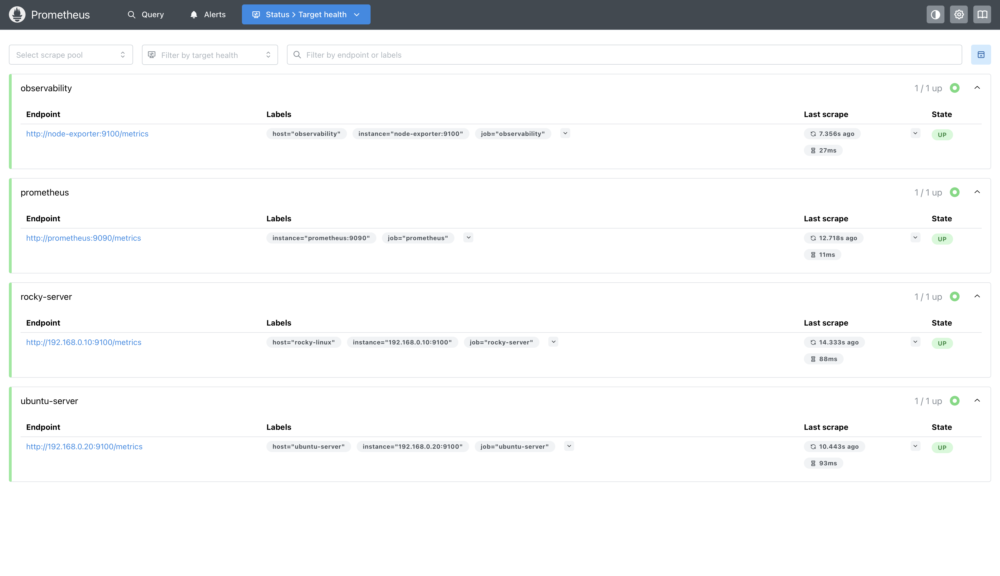
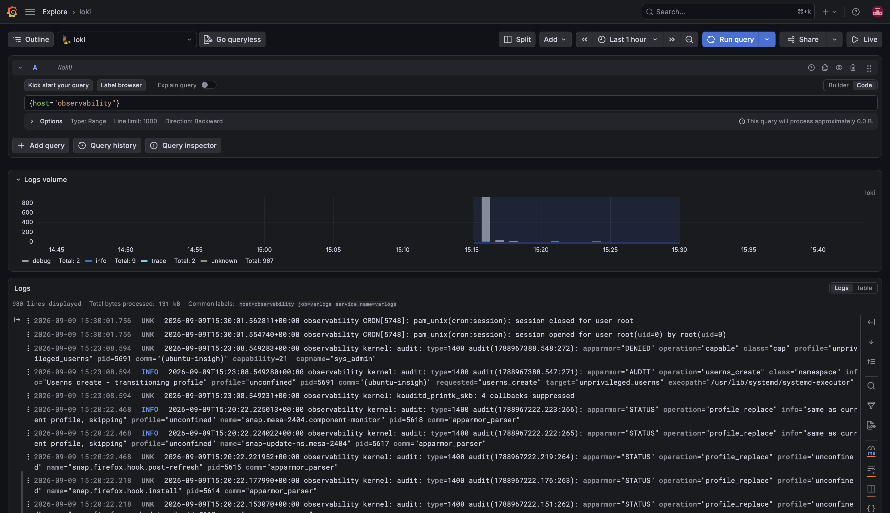
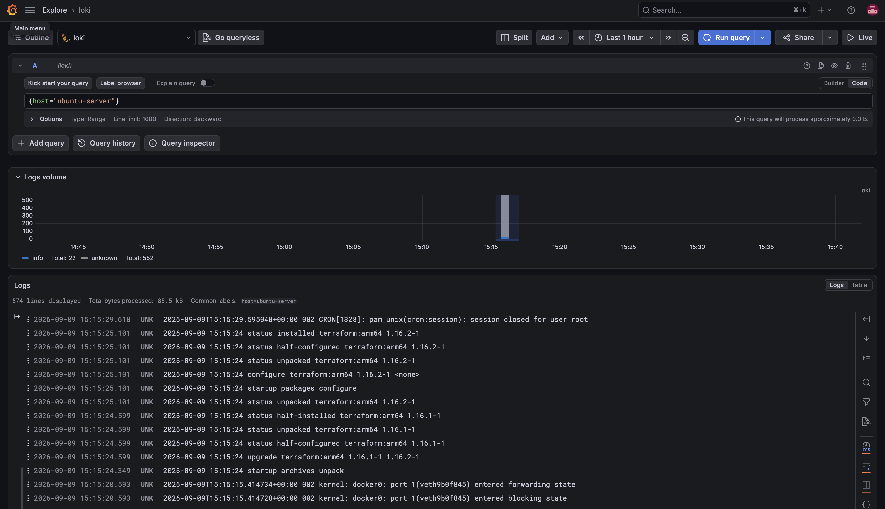
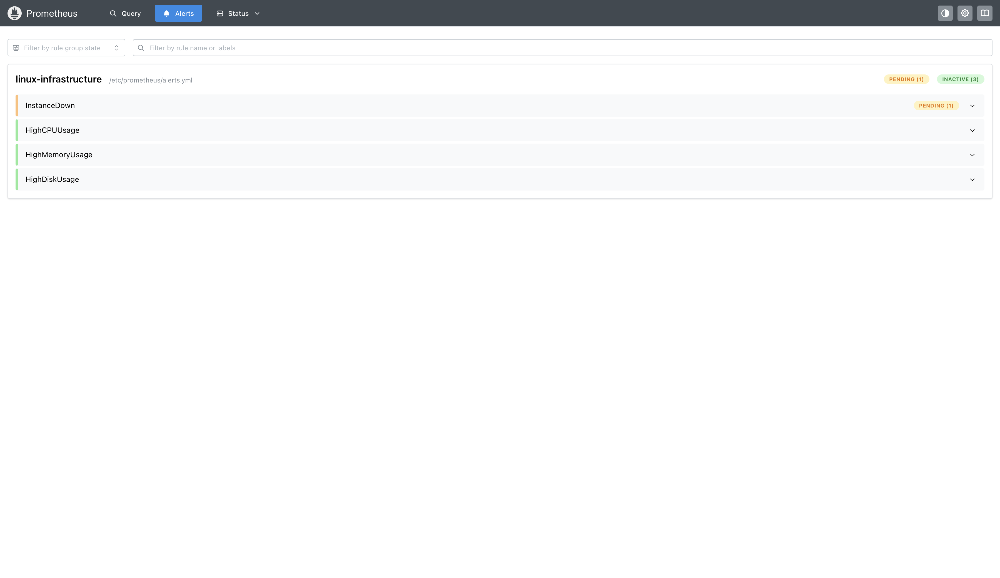
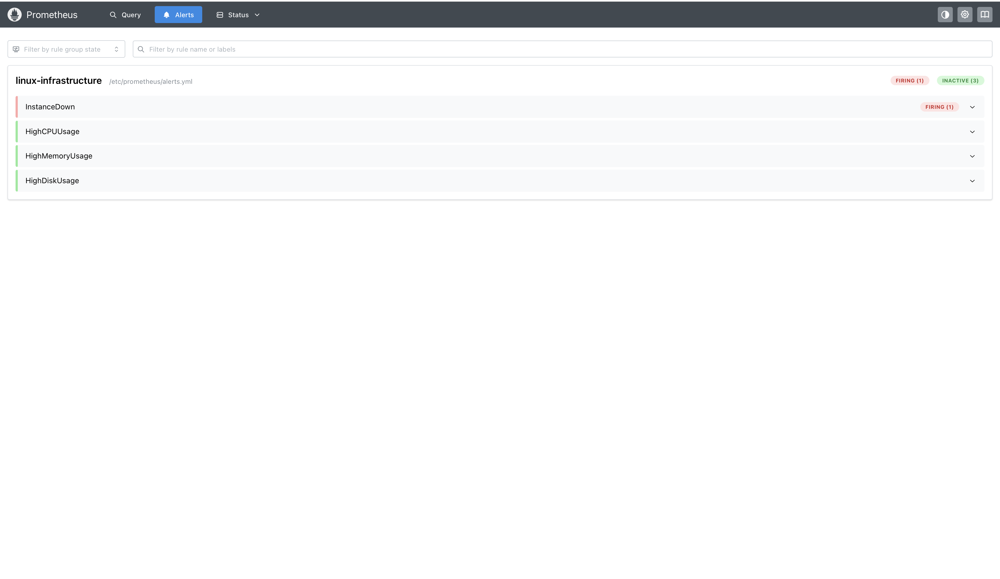
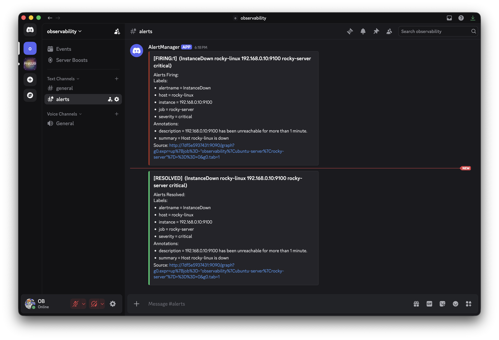
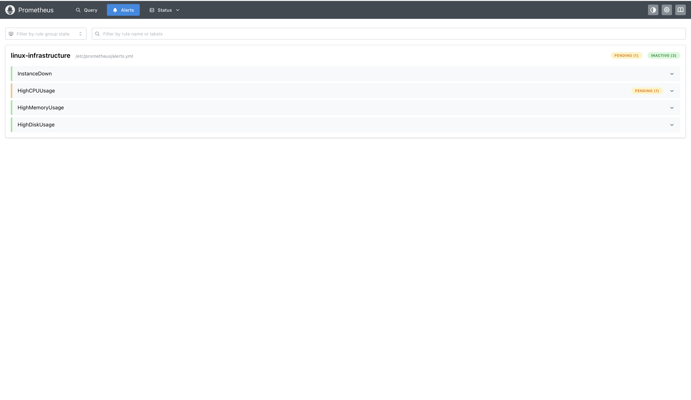

# Linux Observability Lab

A multi-host observability stack for Linux servers: **metrics** with Prometheus and Node Exporter, **logs** with Grafana Alloy and Loki, **dashboards** in Grafana, and **alerts** routed through Alertmanager to Discord.

The lab monitors a mixed fleet (Ubuntu, Rocky Linux, CentOS) from one central host, and was built to practise the monitor → detect → notify → investigate workflow used in Linux operations and cloud support roles.



---

## Highlights

- **Metrics and logs in one place**: Grafana queries both Prometheus and Loki
- **Mixed-distro fleet**: Ubuntu, Rocky Linux, and CentOS hosts monitored side by side
- **Journald log collection** with Grafana Alloy, the successor to Promtail
- **Noise-controlled alerting**: every rule has a `for:` duration, and alerts carry severity labels
- **Real notification path**: Prometheus rule → Alertmanager → Discord (with resolved notifications)
- **Secrets kept out of Git**: the Discord webhook lives in `.env` and is injected with `envsubst`
- **One-command deploy**: the central stack starts with `docker compose up -d`

---

## Architecture

```
                         ┌──────────────┐
                         │   Grafana    │
                         │    :3000     │
                         └──────┬───────┘
                                │ queries
                 ┌──────────────┴──────────────┐
                 ▼                             ▼
          ┌─────────────┐                ┌─────────────┐
          │ Prometheus  │                │    Loki     │
          │    :9090    │                │    :3100    │
          └──┬───────┬──┘                └──────▲──────┘
             │       │ firing alerts            │ push
             │       ▼                          │
             │  ┌──────────────┐          ┌─────┴─────┐
             │  │ Alertmanager │          │   Alloy   │
             │  │    :9093     │          │ (journald)│
             │  └──────┬───────┘          └───────────┘
             │         ▼
             │      Discord
             │ scrapes :9100 every 15s
   ┌─────────┼───────────────┬───────────────┐
   ▼         ▼               ▼               ▼
 Observ.   Ubuntu          Rocky           CentOS
 host      Server          Linux           Server
 Node Exp. Node Exp.       Node Exp.       Node Exp.
```

| Signal  | Path                                              |
| ------- | ------------------------------------------------- |
| Metrics | Node Exporter → Prometheus (pull) → Grafana       |
| Logs    | journald → Alloy → Loki (push) → Grafana          |
| Alerts  | Prometheus rules → Alertmanager → Discord webhook |

---

## Stack

| Component      | Role                                             |
| -------------- | ------------------------------------------------ |
| Prometheus     | Scrapes metrics, stores time series, evaluates alert rules |
| Node Exporter  | Exposes Linux host metrics on port 9100          |
| Loki           | Centralized log storage (single binary, filesystem storage) |
| Grafana Alloy  | Reads the systemd journal on each host and pushes it to Loki |
| Grafana        | Dashboards and log exploration                   |
| Alertmanager   | Alert routing and Discord notifications          |
| Docker Compose | Runs the central stack                           |

## Monitored hosts

| Host name       | Role                                            | Metrics via |
| --------------- | ----------------------------------------------- | ----------- |
| `observability` | Runs the stack (Ubuntu Desktop)                 | Node Exporter container in the Compose stack |
| `ubuntu-server` | Monitored Ubuntu Server                         | Node Exporter (systemd service) on port 9100 |
| `rocky-server`  | Monitored Rocky Linux server                    | Node Exporter (systemd service) on port 9100 |
| `cent-server`   | Monitored CentOS server                         | Node Exporter (systemd service) on port 9100 |

Each target carries a `host` label in `prometheus.yml`, which is what dashboards and alerts group by.

---

## Repository structure

```
linux-observability-lab/
├── docker-compose.yml
├── .gitignore
├── prometheus/
│   ├── prometheus.yml              # scrape jobs, Alertmanager target, rule file
│   └── alerts.yml                  # alert rules
├── alertmanager/
│   └── alertmanager.yml.template   # Discord receiver with webhook placeholder
├── loki/
│   └── loki-config.yml
├── alloy/
│   └── config.alloy                # journald → Loki pipeline
└── docs/
    └── screenshots/
```

---

## Getting started

### Prerequisites

- Docker and Docker Compose on the observability host
- Node Exporter and Grafana Alloy running on every remote host (port 9100 reachable from the observability host, and Loki's port 3100 reachable from the remote hosts)
- A Discord webhook URL

### 1. Clone

```bash
git clone https://github.com/OB-Adams/linux-observability-lab.git
cd linux-observability-lab
```

### 2. Configure the Discord webhook

Create a `.env` file (git-ignored):

```bash
DISCORD_WEBHOOK_URL=https://discord.com/api/webhooks/<id>/<token>
```

Render the Alertmanager config from the template:

```bash
set -a; source .env; set +a
envsubst < alertmanager/alertmanager.yml.template > alertmanager/alertmanager.yml
```

Alertmanager does not expand environment variables in its config file, so the substitution happens before the container starts.

### 3. Set your targets

Edit the static targets in `prometheus/prometheus.yml` to match your hosts.

### 4. Start the stack

```bash
docker compose up -d
docker compose ps
```

### 5. Add Grafana data sources

In Grafana (`:3000`), add two data sources using the Compose service names:

| Data source | URL                    |
| ----------- | ---------------------- |
| Prometheus  | `http://prometheus:9090` |
| Loki        | `http://loki:3100`     |

### Service ports

| Service       | Port  |
| ------------- | ----- |
| Grafana       | 3000  |
| Prometheus    | 9090  |
| Alertmanager  | 9093  |
| Loki          | 3100  |
| Node Exporter | 9100  |

---

## Metrics

Prometheus scrapes every target every **15 seconds**. The dashboard covers CPU, memory, disk, load, network traffic, and host availability.



---

## Logs

`alloy/config.alloy` defines a small pipeline:

1. `loki.source.journal` reads the systemd journal (mounted read-only from `/var/log/journal`), keeping entries up to 12 hours old
2. Entries are labelled `job="journal"` and `host="<name>"`
3. `loki.write` pushes them to `http://loki:3100/loki/api/v1/push`

Example LogQL queries in Grafana Explore:

```logql
{job="journal"}
{job="journal", host="observability"}
{job="journal"} |= "error"
```

**Where Alloy runs.** On the observability host, Alloy is a container in the Compose stack, which is why this committed config hardcodes `host = "observability"` and talks to Loki at `loki:3100`. On each monitored host, Alloy and Node Exporter run as **systemd services** instead, so they start on boot and don't depend on Docker. Each remote Alloy uses the same pipeline with its own `host` label and pushes to the observability server's Loki endpoint on port 3100. The remote agent configs are not part of this repo.

| Observability server | Ubuntu Server |
| -------------------- | ------------- |
|  |  |

---

## Alerting

Prometheus evaluates `prometheus/alerts.yml` and sends firing alerts to Alertmanager.

| Alert             | Condition                              | `for:` | Severity |
| ----------------- | -------------------------------------- | ------ | -------- |
| `InstanceDown`    | `up == 0` for the observability, Ubuntu, Rocky, and CentOS targets | 1m | critical |
| `HighCPUUsage`    | CPU usage above 80% (5m average)       | 5m     | warning  |
| `HighMemoryUsage` | Memory usage above 85% (`MemAvailable`-based) | 5m | warning |
| `HighDiskUsage`   | Root filesystem usage above 85%        | 5m     | warning  |

Alerts move through **inactive → pending → firing**, so brief spikes never reach Discord. Alertmanager sends both firing and resolved notifications (`send_resolved: true`).

### Alert lifecycle

| Pending | Firing |
| ------- | ------ |
|  |  |




---

## Security

- The webhook is stored only in `.env` (git-ignored)
- `alertmanager.yml.template` holds only the `${DISCORD_WEBHOOK_URL}` placeholder
- The generated `alertmanager.yml` is git-ignored
- Loki has `auth_enabled: false` and no service is behind TLS, which is acceptable for an isolated lab network but not for production

---

## What I learned

- Pull-based metrics and push-based logs solve different problems and complement each other
- Alert quality matters as much as coverage: thresholds, `for:` windows, and severity labels keep alerts actionable
- Running Ubuntu, Rocky, and CentOS together exposes real differences in firewalls, SELinux, and package management
- Alloy replaces Promtail with a more flexible pipeline model, and journald is a cleaner log source than tailing files
- Secrets handling has to be designed in from the start

## Possible improvements

- Add `group_by`, `group_wait`, and `repeat_interval` to the Alertmanager route, and route by severity
- Pin image versions instead of `latest`
- Provision Grafana data sources and dashboards as code
- Set Loki and Prometheus retention explicitly
- Link or fold in the automation that deploys the remote Node Exporter and Alloy services, so the whole fleet is reproducible from code
- Add TLS and authentication in front of Grafana and the APIs
- Add log-based alerts using the Loki ruler

---

## Author

**OB Adams**: Linux, Cloud, DevOps, and Infrastructure Automation
